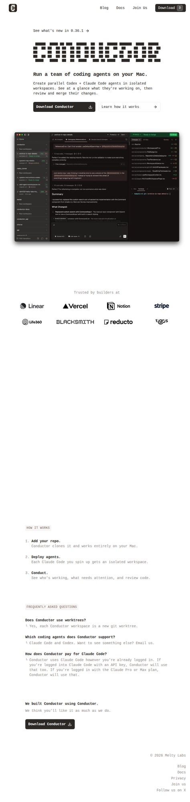
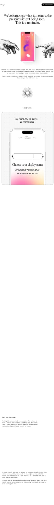
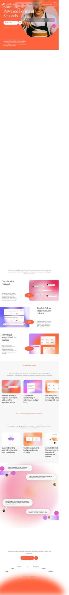
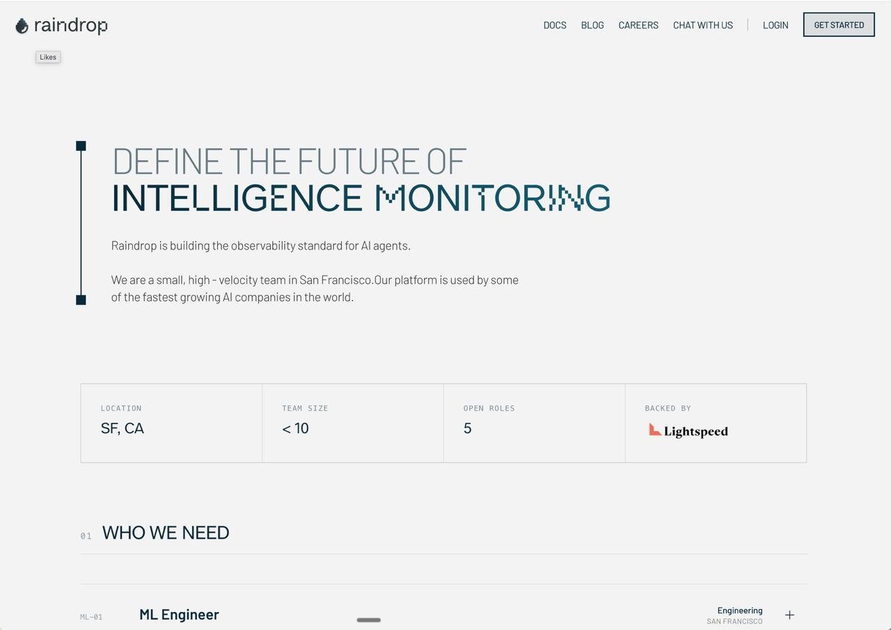

# Archive

A collection of websites with great design, interaction, or inspiration.

  

    
    

      <h3 class="font-semibold text-base"><a href="/archive/meaningalignment.org" class="hover:underline">MeaningAlignment.org</a></h3>
      
Clean, minimal research site with thoughtful information architecture — card-based portfolio, clear team structure, content-first.

      <a href="https://www.meaningalignment.org" class="text-xs text-blue-500 mt-2 block">meaningalignment.org →</a>
    

  

  

    
    

      <h3 class="font-semibold text-base"><a href="/archive/claude.com-product-overview" class="hover:underline">Claude.com</a></h3>
      
Really great, simple design with warmth. All about being a "thinking partner" — creativity and collaboration come through strongly.

      <a href="https://claude.com/product/overview" class="text-xs text-blue-500 mt-2 block">claude.com →</a>
    

  

  

    
    

      <h3 class="font-semibold text-base"><a href="/archive/conductor.build" class="hover:underline">Conductor.build</a></h3>
      
Simple, dev-oriented site with a standout pixel/dot-matrix logo, elegant layout, and solid overall design.

      <a href="https://www.conductor.build" class="text-xs text-blue-500 mt-2 block">conductor.build →</a>
    

  

  

    
    

      <h3 class="font-semibold text-base"><a href="/archive/departuremono.com" class="hover:underline">DepartureMono.com</a></h3>
      
Beautiful, elegant, software-geeky energy. Also feels suitable for writing papers.

      <a href="https://departuremono.com" class="text-xs text-blue-500 mt-2 block">departuremono.com →</a>
    

  

  

    
    

      <h3 class="font-semibold text-base"><a href="/archive/frankchimero.com" class="hover:underline">FrankChimero.com</a></h3>
      
Beautifully plain personal site for a designer and writer, with a strong content-first structure.

      <a href="https://frankchimero.com" class="text-xs text-blue-500 mt-2 block">frankchimero.com →</a>
    

  

  

    
    

      <h3 class="font-semibold text-base"><a href="/archive/greptile.com" class="hover:underline">Greptile.com</a></h3>
      
Cool animation and very simple offer.

      <a href="https://www.greptile.com" class="text-xs text-blue-500 mt-2 block">greptile.com →</a>
    

  

  

    
    

      <h3 class="font-semibold text-base"><a href="/archive/interludeapp.net" class="hover:underline">InterludeApp.net</a></h3>
      
Really elegant design. Love the typeface. Very clean.

      <a href="https://interludeapp.net" class="text-xs text-blue-500 mt-2 block">interludeapp.net →</a>
    

  

  

    
    

      <h3 class="font-semibold text-base"><a href="/archive/makingsoftware.com" class="hover:underline">MakingSoftware.com</a></h3>
      
Really beautiful and elegant; software-geeky energy, but would also be good for writing papers.

      <a href="https://www.makingsoftware.com" class="text-xs text-blue-500 mt-2 block">makingsoftware.com →</a>
    

  

  

    
    

      <h3 class="font-semibold text-base"><a href="/archive/mobbin.com" class="hover:underline">Mobbin.com</a></h3>
      
Comprehensive design inspiration platform and pattern library for product designers.

      <a href="https://mobbin.com" class="text-xs text-blue-500 mt-2 block">mobbin.com →</a>
    

  

  

    
    

      <h3 class="font-semibold text-base"><a href="/archive/nan.fyi" class="hover:underline">Nan.fyi</a></h3>
      
Very clean B&amp;W theme for a blog.

      <a href="https://nan.fyi" class="text-xs text-blue-500 mt-2 block">nan.fyi →</a>
    

  

  

    
    

      <h3 class="font-semibold text-base"><a href="/archive/nuraform.com" class="hover:underline">Nuraform.com</a></h3>
      
Exceptional mobile interaction and behaviour — particularly the user examples section.

      <a href="https://www.nuraform.com" class="text-xs text-blue-500 mt-2 block">nuraform.com →</a>
    

  

  

    
    

      <h3 class="font-semibold text-base"><a href="/archive/previewlinks.io" class="hover:underline">PreviewLinks.io</a></h3>
      
Clean, simple design. Standard SaaS components done nicely and cleanly. Good colours too.

      <a href="https://previewlinks.io" class="text-xs text-blue-500 mt-2 block">previewlinks.io →</a>
    

  

  

    
    

      <h3 class="font-semibold text-base"><a href="/archive/raindrop.ai" class="hover:underline">Raindrop.ai</a></h3>
      
Clean tech-y vibe that could work for a data portal.

      <a href="https://raindrop.ai" class="text-xs text-blue-500 mt-2 block">raindrop.ai →</a>
    

  

  

    
    

      <h3 class="font-semibold text-base"><a href="/archive/rywalker.com" class="hover:underline">RyWalker.com</a></h3>
      
Simple, clean personal site oriented to knowledge base sharing.

      <a href="https://rywalker.com" class="text-xs text-blue-500 mt-2 block">rywalker.com →</a>
    

  

