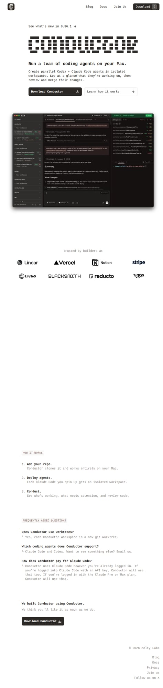

Simple, dev-oriented site with a standout pixel/dot-matrix logo, elegant layout, and solid overall design.

https://www.conductor.build

Mac app by Melty Labs for running parallel Claude Code and Codex agents in isolated git worktrees. Trusted by Linear, Vercel, Notion, Stripe teams.
